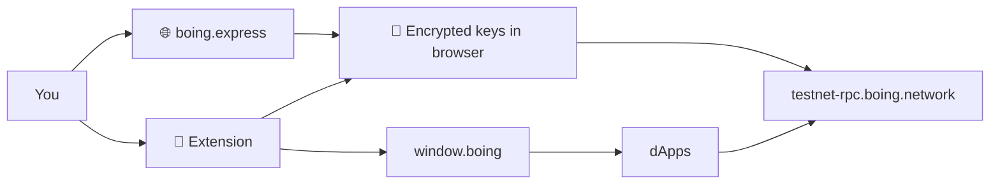

# 👛 Boing Express (Boing Wallet)

Non-custodial wallet for **Boing Network**. Keys are generated and stored **only in your browser**. Live at **[boing.express](https://boing.express)**.

> 👋 **Everyday users:** create or import a wallet, copy your 64-character address, get testnet BOING from [the faucet](https://boing.network/faucet), send, stake. The Chrome/Firefox extension adds “Connect wallet” for dApps.  
> 🛠️ **Developers:** inject `window.boing`. Methods: `boing_requestAccounts`, `boing_sendTransaction`, DEX list RPCs. See [docs/WALLET_CONNECTION_AND_API.md](docs/WALLET_CONNECTION_AND_API.md).  
> 🛰️ **Operators:** `VITE_BOING_TESTNET_RPC` defaults to `https://testnet-rpc.boing.network`. Mainnet stays **off** until `VITE_BOING_MAINNET_RPC` is a distinct URL.



## ✨ Features

- **Boing Network:** Ed25519 addresses (32-byte AccountId, 64-char hex), send/receive BOING, testnet faucet, staking (Bond/Unbond/ClaimUnbond)
- **Signing:** BLAKE3 signable hash + Ed25519; bincode layout matches `boing-primitives`
- **Security:** Client-only key generation, password-encrypted storage (AES-GCM), keys never sent to any server
- **Extension:** Injects `window.boing` for dApp connect; Connected sites management in the popup

## 🧰 Tech stack

- **React 18** + **TypeScript** + **Vite** (static build → `dist/`)
- **@noble/ed25519** and **@noble/hashes** (BLAKE3)
- **Cloudflare Pages**; optional **RPC gateway Worker** ([docs/RPC_GATEWAY.md](docs/RPC_GATEWAY.md))

## 🚀 Quick start

```bash
pnpm install
pnpm dev
```

Open http://localhost:5173. Production build: `pnpm build` → `dist/`.

## ⚙️ Environment

| Variable | Description |
|----------|-------------|
| `VITE_BOING_TESTNET_RPC` | Testnet JSON-RPC (default `https://testnet-rpc.boing.network`) |
| `VITE_BOING_MAINNET_RPC` | Optional mainnet JSON-RPC. Leave unset until official mainnet is published |

Set these in Cloudflare Pages **Build → Environment variables** (baked in at build time).

## ☁️ Cloudflare (boing.express)

- Pages project, build `pnpm build`, output `dist`, domain **boing.express**
- GitHub Actions deploys on `main`. Secrets: `CLOUDFLARE_ACCOUNT_ID`, `CLOUDFLARE_API_TOKEN`
- Optional RPC gateway: `pnpm run gateway:deploy` — see [docs/RPC_GATEWAY.md](docs/RPC_GATEWAY.md)

```bash
pnpm build
npx wrangler pages deploy dist --project-name=boing-wallet
```

## 🧩 Browser extension

```bash
pnpm run build:extension
```

Chrome: `chrome://extensions` → Developer mode → Load unpacked → **`extension/`** folder.  
Firefox: `about:debugging` → Load Temporary Add-on → `extension/manifest.json`.

Recommended pre-review copy: `pnpm run build:extension:unpacked` → load **`extension-unpacked/`**. Store zip: `pnpm run zip:extension`. Listing checklist: [docs/EXTENSION_STORE.md](docs/EXTENSION_STORE.md).

## 📡 Boing Network details

- **Address:** 32-byte AccountId = Ed25519 public key, 64 hex chars (optional `0x`)
- **Submit:** `hex(bincode(SignedTransaction))` via `boing_submitTransaction`
- **Explorer:** `https://boing.observer/account/<address>`
- **Alignment:** [THREE-CODEBASE-ALIGNMENT.md](https://github.com/Boing-Network/boing.network/blob/main/docs/THREE-CODEBASE-ALIGNMENT.md)

## 📚 Docs in this repo

| Doc | For |
|-----|-----|
| [docs/WALLET_CONNECTION_AND_API.md](docs/WALLET_CONNECTION_AND_API.md) | `window.boing` provider API |
| [docs/DEVELOPMENT.md](docs/DEVELOPMENT.md) | CI, tests, Chrome Web Store checklist |
| [docs/BOING-EXPRESS-WALLET.md](docs/BOING-EXPRESS-WALLET.md) | Product + integration spec |
| [docs/RPC_GATEWAY.md](docs/RPC_GATEWAY.md) | Optional HTTPS JSON-RPC Worker |
| [docs/CODEBASE-ALIGNMENT.md](docs/CODEBASE-ALIGNMENT.md) | Local summary of cross-repo URLs |
| [docs/HANDOFF.md](docs/HANDOFF.md) | Portal / protocol handoff |
| [docs/DESIGN_SYSTEM.md](docs/DESIGN_SYSTEM.md) | Aqua Personal tokens |

## License

MIT
